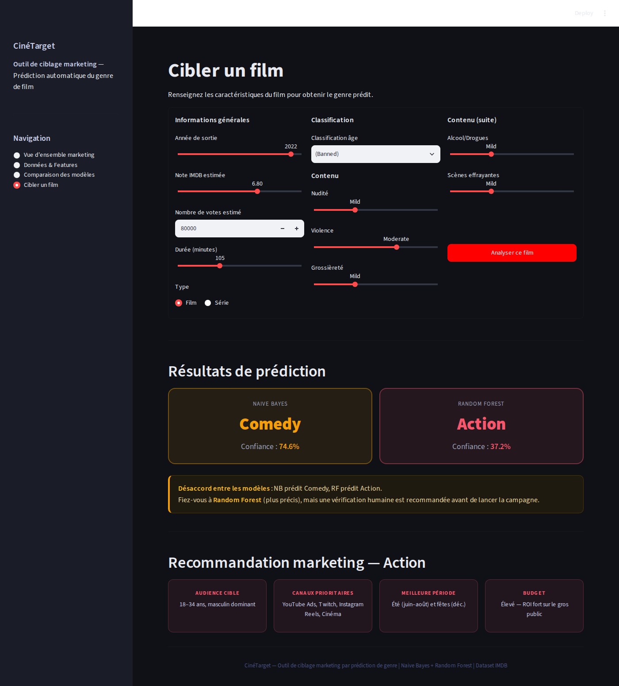

# CinéTarget - prédire le genre d'un film pour cibler sa promotion

Application Streamlit qui prédit le genre d'un film (Action, Horror, Comedy ou Drama) à partir de ses seules caractéristiques chiffrées, sans lire le synopsis, puis propose une stratégie marketing adaptée au genre prédit : audience, canaux, période de sortie, budget.



## Données

Le fichier `imdb.csv` contient environ 6 200 films et séries IMDb avec leur note, le nombre de votes, la durée, la classification d'âge et le niveau de contenu sensible (nudité, violence, grossièreté, alcool, scènes effrayantes).

Préparation :

- conversion des colonnes numériques et nettoyage du nombre de votes ;
- encodage ordinal des niveaux de contenu (None / Mild / Moderate / Severe) et de la classification d'âge ;
- suppression des lignes en double (il y en a environ 1 150 dans le fichier) ;
- un seul genre cible par film, parmi les 4 retenus ;
- rééquilibrage des classes par sous-échantillonnage : Horror est la classe la plus petite, les autres sont ramenées à la même taille.

On ajoute aussi quelques variables construites : un score d'intensité du contenu, note × log(votes), sorti après 2015, durée d'au moins 120 min.

## Modèles

Deux modèles sont entraînés sur le même découpage (80 / 20, stratifié) :

| Modèle | Accuracy sur le jeu de test |
|---|---|
| Naive Bayes (gaussien, variables normalisées) | 52 % |
| Random Forest (200 arbres) | 63 % |

Avec 4 classes équilibrées, un tirage au hasard donnerait 25 %. Random Forest est meilleur sur les 4 genres. Il reconnaît bien Horror (F1 de 76 %) et Comedy (70 %), mais Action et Drama restent plus difficiles (autour de 52 %). Les variables qui comptent le plus sont la durée, le nombre de votes et la note.

Quand les deux modèles ne prédisent pas le même genre, l'application le signale et recommande une vérification manuelle.

## L'application

Quatre pages :

1. Vue d'ensemble : la problématique, les chiffres clés et une fiche marketing par genre ([capture](captures/1_vue_ensemble.png)).
2. Données : la répartition des genres avant et après rééquilibrage, et l'importance des variables ([capture](captures/2_donnees.png)).
3. Comparaison des modèles : les matrices de confusion et le F1-score par genre ([capture](captures/3_modeles.png)).
4. Cibler un film : on saisit les caractéristiques d'un film et on obtient le genre prédit par chaque modèle, puis la recommandation marketing.

## Lancer le projet

```bash
pip install -r requirements.txt
streamlit run app.py
```

## Limites

- Les recommandations marketing par genre sont des règles fixes, écrites à la main. Elles ne sont pas apprises à partir de données de campagnes.
- Les variables disponibles restent limitées pour distinguer des genres proches (un drame et une comédie ont souvent la même durée et la même note). Ajouter le texte du synopsis ou les mots-clés améliorerait sans doute beaucoup les résultats.
